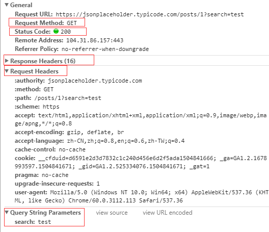

# HTTP基础
其实说起来这部分的内容是最基础也是最复杂的，在大学的课程中我们可能会接触到一些相关的知识，但是在做Web开发之前，我们还是有必要再熟悉下相关的内容。

## HTTP request & response
在web开发中我们主要关心HTTP请求的几种类型`Get`、`Post`、`Put`、`Delete`以及`Option`，HTTP请求中的`Header`信息，HTTP请求中的请求参数以及body内容，下面以一张图简单介绍下。

图中红框展示了一个HTTP Get请求的几个重要数据，包括请求的地址（未标出，在最上面），请求的方法(Get)，请求头信息(Request Headers)，相应头信息(Response Headers)，以及Get请求的参数(Query String Parameters)。
而Post请求则有些不同

从图中可以看到Post数据传的是Form Data，也就是上面说的Body，且一般不传Query String。

### Content Type
图中Request Headers里有一个`content-type`信息，这也是一个在开发中很有用的字段，需要做[必要的了解](http://homeway.me/2015/07/19/understand-http-about-content-type/)。

### HTTP Response code
对于[常见的HTTP状态码](http://www.bkjia.com/headlines/491296.html)也需要做必要的了解。

## 收获
学习完这章后应该对于HTTP请求的各个环节比较熟悉，能够用一个HTTP请求中分析出各种信息。